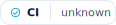
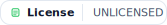
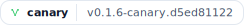

# Flux Site

<!-- FLUX:BADGES:BEGIN -->
<p>
  <a href="https://www.npmjs.com/package/@flux-lang/flux" target="_blank" rel="noreferrer">
<picture>
      <source media="(prefers-color-scheme: dark)" srcset="./badges/generated/flux-npm.dark.svg">
      
    </picture>
  </a>
  <a href="https://github.com/cbassuarez/flux-site/actions/workflows/deploy.yml" target="_blank" rel="noreferrer">
<picture>
      <source media="(prefers-color-scheme: dark)" srcset="./badges/generated/ci.dark.svg">
      
    </picture>
  </a>
  <a href="https://github.com/cbassuarez/flux-site/blob/main/package.json" target="_blank" rel="noreferrer">
<picture>
      <source media="(prefers-color-scheme: dark)" srcset="./badges/generated/license.dark.svg">
      
    </picture>
  </a>
  <a href="https://flux-lang.org/docs" target="_blank" rel="noreferrer">
<picture>
      <source media="(prefers-color-scheme: dark)" srcset="./badges/generated/docs.dark.svg">
      
    </picture>
  </a>
  <a href="https://github.com/cbassuarez/flux/discussions" target="_blank" rel="noreferrer">
<picture>
      <source media="(prefers-color-scheme: dark)" srcset="./badges/generated/discord.dark.svg">
      
    </picture>
  </a>
  <a href="https://github.com/cbassuarez/flux-site/security/policy" target="_blank" rel="noreferrer">
<picture>
      <source media="(prefers-color-scheme: dark)" srcset="./badges/generated/security.dark.svg">
      
    </picture>
  </a>
  <a href="https://github.com/cbassuarez/flux-site/commits/main" target="_blank" rel="noreferrer">
<picture>
      <source media="(prefers-color-scheme: dark)" srcset="./badges/generated/maintained.dark.svg">
      
    </picture>
  </a>
  <a href="https://www.npmjs.com/package/@flux-lang/flux" target="_blank" rel="noreferrer">
<picture>
      <source media="(prefers-color-scheme: dark)" srcset="./badges/generated/channel.flux.stable.dark.svg">
      
    </picture>
  </a>
  <a href="https://www.npmjs.com/package/@flux-lang/flux" target="_blank" rel="noreferrer">
<picture>
      <source media="(prefers-color-scheme: dark)" srcset="./badges/generated/channel.flux.canary.dark.svg">
      
    </picture>
  </a>
</p>
<!-- FLUX:BADGES:END -->

A Vite + React + TypeScript microsite for the Flux score language, styled with Tailwind CSS and deployed to GitHub Pages.

## Development

```bash
npm install
npm run dev
```

## Editor (served at /edit)

```bash
pnpm dev
```

```bash
pnpm build:edit
```

To test against the Flux viewer server, run the viewer and open `http://localhost:<port>/edit` so the editor loads under the `/edit/` base path.

To build the marketing site at the root path, set `VITE_BASE=/`:

```bash
pnpm build:site
```

## Production build

```bash
npm run build
npm run preview
```
